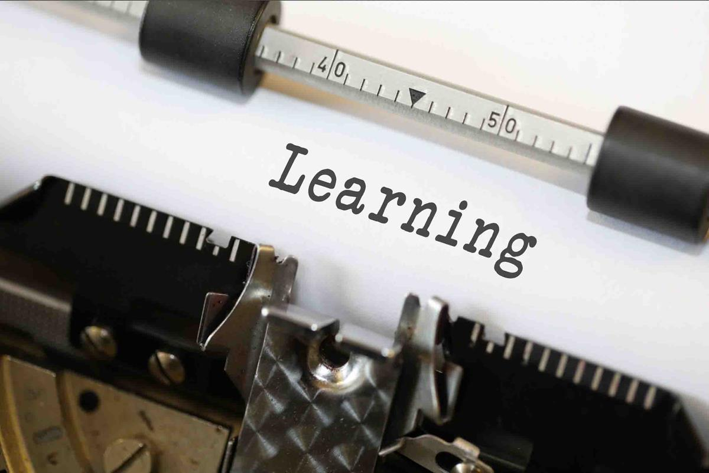
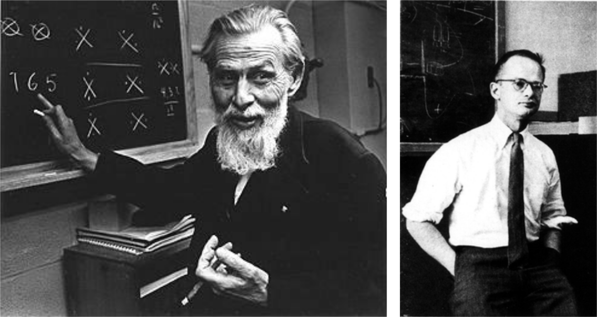
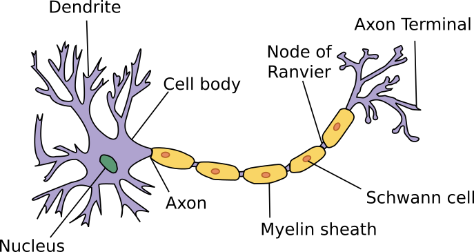
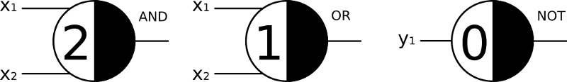
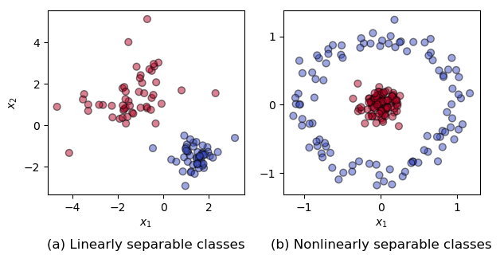
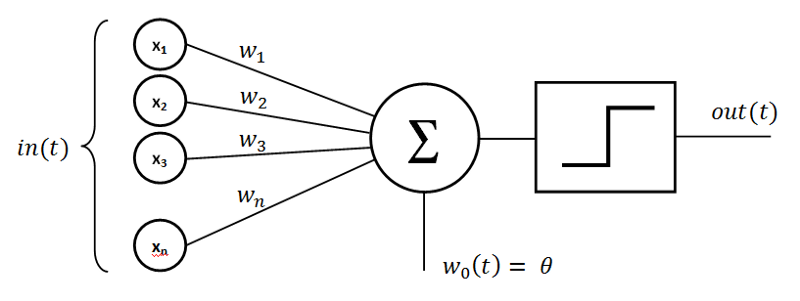

Rosenblatt's perceptron, the first modern neural network
===========================================================
*A quick introduction to deep learning for beginners*

**This post is the first of a series adapted from the doctoral course "Introduction to deep learning for beginners" I will teach next year at Ecole Nationale Supérieure d'Arts et Métiers (Paris, France). The aim of this series is to help beginners gradually build their intuition about the internal mechanics of neural networks as well as providing them with a basic understanding of the mathematics they rely on. Some historical aspects will also be addressed. Note finally that, because you may not have the time (nor the will) to read all of the posts from this series, each of them is written to be as much as possible independent from one another. Enjoy!**

 

Over the past decade, machine learning has been having a transformative impact in numerous fields such as cognitive neurosciences, image classification, recommendation systems or engineering. Recently, neural networks and deep learning have attracted even more attention with their successes being regularly reported by both the scientific and mainstream media, see for instance Deep Mind's AlphaGo and AlphaGo Zero [1] or the more recent AlphaStar. This renewed interest is partially due to the access to open-source libraries such as TensorFlow, PyTorch, Keras or Flux.jl to name just a few.

Although this increasing access to efficient and versatile libraries has opened the door to innovative applications by reducing the knowledge required in computer science to implement deep learning algorithms, a good understanding of the underlying mathematical theories is still needed in order to come up with efficient neural networks architecture for the task considered. Unfortunately, the image society has of mathematics may scare students away (see the documentary [How I came to hate math](https://www.youtube.com/watch?time_continue=23&v=jSt6Opt5nm4) for an illustration). This lack of mathematical literacy may also be one of the reasons why politics and non-tech industries are often either skeptic or way too optimistic about deep learning performances and capabilities. Additionally, Susannah Shattuck recently published a post discussing [why people don't trust AI](https://towardsdatascience.com/people-dont-trust-ai-we-need-to-change-that-d1de5a4a0021) and why industry may be reluctant to adopt it. One of the key reasons she cites, although not the only one, is the following :

> In a [2018 study from IBM](https://www.ibm.com/downloads/cas/QQ5KZLEL), 63% of respondents cited a lack of technical skills as a barrier to AI implementation.

## Historical perspectives and objectives of this series

Even though deep learning made it only recently to the mainstream media, its history dates back to the early 1940's with the first mathematical model of an artificial neuron by McCulloch & Pitts. Since then, numerous architectures have been proposed in the scientific literature, from the single layer perceptron of Frank Rosenblatt (1958) to the recent neural ordinary differential equations (2018), in order to tackle various tasks (e.g. playing Go, time-series prediction, image classification, pattern extraction, etc). The timeline below (courtesy of Favio Vázquez) provides a fairly accurate picture of  deep learning's history.

As you can see, this history is pretty dense. Covering all of these different architectures over the course of a limited number of blog posts would thus be unrealistic. Moreover, some of these neural networks architectures may draw from advanced mathematical fields or even from statistical physics. Rather than discussing at length every single one of these architectures, the aim of this series is to gradually introduce beginners to the mathematical theories that underlie deep learning, the basic algorithms it uses as well as providing some historical perspectives about its development. For that purpose, we will start with simple linear classifiers such as Rosenblatt's single layer perceptron [2] or the logistic regression before moving on to fully connected neural networks and other widespread architectures such as convolutional neural networks or LSTM networks. Various other subjects, e.g. convex and non-convex optimization, the universal approximation theorem or technical and ethical good practices will also be addressed along the way. Because our aim is to help beginners understand the inner workings of deep learning algorithms, all of the implementations that will be presented rely essentially on SciPy and NumPy rather than on highly optimized libraries like TensorFlow, at least whenever possible. Moreover, for the sake of pedagogy and science outreach, all the codes used in this series are freely available on GitHub. Without further ado, let us get started!

***

## McCulloch & Pitts' model of artificial neurons (1943)

The very first mathematical model of an artificial neuron was the Threshold Logic Unit proposed by the Warren S. McCulloch (1898–1969, American neurophysiologist) and Walter H. Pitts Jr (1923–1969, American logician) in 1943. Before diving into their model, let us however quickly review first how a biological neuron actually works.

 

 Left: Warren S. McCuloch. Right: Walter H. Pitts Jr.

### High level description of biological neurons

Neurons are the building blocks of the brain. In a nutshell, neurons are electrically excitable cells that communicates with other cells via specialized connections. Different biological models exist to describe their properties and behaviors, see for instance
- the Integrate-and-Fire model proposed by [Louis Lapicque](https://en.wikipedia.org/wiki/Louis_Lapicque) (1866–1952, French neuroscientist) as early as 1907.
- the [Hodgkin-Huxley model](https://en.wikipedia.org/wiki/Hodgkin%E2%80%93Huxley_model), named after [Alan A. Hodgkin](https://en.wikipedia.org/wiki/Alan_Lloyd_Hodgkin) (1914–1998, English physiologist and biophysicist) and [Andrew F. Huxley](https://en.wikipedia.org/wiki/Andrew_Huxley) (1917–2012, English physiologist and biophysicist) who won the 1963 Nobel Prize in Physiology and Medicine.
- the [FitzHugh-Nagumo model](https://en.wikipedia.org/wiki/FitzHugh%E2%80%93Nagumo_model), named after Richard FitzHugh (1922–2007, American biophysicist) and J. Nagumo (Japanese engineer), which basically is a simplification of the Hodgkin-Huxley model.
- or the more recent [model of spiking neurons](https://www.izhikevich.org/publications/spikes.htm) by Eugene M. Izhikevich (born 1967, Russian mathematician).

Although some of these models start to be adopted as the building blocks of elaborate neural networks (see spiking neural nets for instance), we will hereafter restrict ourselves to a very high-level description of neurons. A schematic representation is shown in the figure below. For our purposes, only the following elements are of interest to us :

- **Dendrites**, also known as dendrons, are branched protoplasmic extensions of a nerve cell that propagate eletrochemical stimulation received from other neural cells to the cell body (or soma).
- **Soma** is where the signals received from the dendrites are joined and passed on. It contains many organelles as well the as the cell nucleus.
- **Axon hillock** is a specialized part of the soma that connects to the axon. It is it that controls the firing of the neuron. If the total strength of the signal it receives exceeds its threshold limit, the neuron will fire a signal (known as an action potential) down the axon.
- **Axon** is the elongated fiber extending from the soma down to the terminal endings. Its role is to transmit the neural signal to other neurons through is synapses.
- **Synapses** are a small gaps located at the very end of the axon terminal connecting the neuron to other nerve cells. There, neurotransmitters are used to carry the signal across the synapse to other neurons.

The operating principle of a biological neuron can be summarized as follows. First, it takes inputs from its dendrites (i.e. from other neurons). In a second step, a weighted sum of these input is performed within the soma. The result is then passed on to the axon hillock. If this weighted sum is larger than the threshold limit, the neuron will fire. Otherwise, it stays at rest. The state of our neuron (on or off) then propagates through its axon and is passed on to the other connected neurons via its synapses. Albeit very simple, this high-level description of the operating principle of a biological neuron is sufficient to understand the mathematical model of an artificial neuron proposed by McCulloch & Pitts in 1943.

### A mathematical model of artificial neurons

Based on this basic understanding of the neuron's operating principle, McCulloch & Pitts proposed the very first mathematical model of an artificial neuron in the their seminal paper A logical calculus of the ideas immanent in nervous activity [3] back in 1943. Although very simple, their model has proven extremely versatile and easy to modify. Today, variations of their original model have now become the elementary building blocks of most neural networks, from the simple single layer perceptron all the way to the 152 layers-deep neural networks used by Microsoft to win the 2016 ImageNet contest.

McCulloch & Pitts' neuron model, hereafter denoted simply as MCP neuron, can be defined by the following rules :
- It has a binary output $y \in \left\{0 , 1 \right\}$, where $y = 1$ indicates that the neuron fires and $y = 0$ that it is at rest.
- It has a number $N$ of exitatory binary inputs $x_k \in \left\{ 0, 1\right\}$.
- It has a single inhibitory input $i$. If it is on, the neuron cannot fire.
- It has a threshold value $\theta$. If the sum of its inputs is larger than this critical value, the neuron fires. Otherwise it stays at rest.

Given the input $\bm{x} = \begin{bmatrix} x_1 & x_2 & \cdots & x_n \end{bmatrix}^T$, the inhibitory input $i$ and the threshold $\theta$, the output y is computed as follows

$$
\sigma(\bm{x}) = \begin{cases}
                      1 \text{ if } \displaystyle \sum_{k=1}^n x_k \geq \theta \text{ and } i=0 \\
                      0 \text{ otherwise.}
                     \end{cases}
$$

For anyone with basic knowledge of neural network, such a model looks suspiciously like a modern artificial neuron, and that is precisely because it is!

A lot of different papers and blog posts have shown how one could use MCP neurons to implement different boolean functions such as OR, AND or NOT. These are illustrated below using [Marvin Minsky](https://en.wikipedia.org/wiki/Marvin_Minsky)'s notation.

 

It must be emphasized that, by stacking multiple MCP neurons, more complex functions (e.g. a flip-flop, division by two, etc) can also be represented. Despite this flexibility, MCP neurons suffer from major limitations, namely
- A single MCP neuron cannot represent the XOR boolean function, or any other nonlinear function.
- All of the synaptic weights are set to unity, implying that all the inputs contributes equally to the output.
- The function considered needs to be hard-coded by the user. It cannot be learned from data.
- The absolute inhibition rule (i.e. if the inhibitory input i is on, the neuron cannot fire) is too restrictive.

Nonetheless, the MCP neuron caused great excitation in the research community back then and, more than half a century later, gave rise to modern deep learning. Along the way, one of the most important improvement, tackling some of the MCP neuron's limitations, came from Frank Rosenblatt and his perceptron.

***

## Rosenblatt's single layer perceptron (1957)

Almost fifteen years after McCulloch & Pitts [3], the American psychologist Frank Rosenblatt (1928–1971), inspired by the [Hebbian theory](https://en.wikipedia.org/wiki/Hebbian_theory) of synaptic plasticity (i.e. the adaptation of brain neurons during the learning process), came up with the perceptron, a major improvement over the MCP neuron model. This invention granted him international recognition and, to this date, the Institute of Electrical and Electronics Engineers (IEEE), "*the world's largest professional association dedicated to advancing technological innovation and excellence for the benefit of humanity*", named its annual award in his honor.

 

 Left : Frank Rosenblatt, from Wikipedia. Right : Mark I Perceptron machine, the first implementation of the perceptron algorithm. From Wikipedia as well.

 

Rosenblatt's major achievement has been to show that, by relaxing some of the MCP's rules (namely the absolute inhibition, the equal contribution of all inputs as well as their integer nature), artificial neurons could actually learn from data. More importantly, he came up with a supervised learning algorithm for this modified MCP neuron model that enabled the artificial neuron to figure out the correct weights directly from training data by itself. Before diving into the machine learning fun stuff, let us quickly discuss the type of problems that can be addressed by the perceptron.

### Binary classification

Binary (or binomial) classification is the task of classifying the elements of a given set into two groups (e.g. classifying whether an image depicts a cat or a dog) based on a prescribed rule. The figure below depicts two instances of such a problem. On the left, the task is to identify the separatrix between two *linearly separable classes* (i.e. the separatrix is a simple straight line) while, on the right, the two classes are *nonlinearly separable* (i.e. the separatrix is **not** a simple straight line).

 

As we will see, Rosenblatt's perceptron can handle only classification tasks for linearly separable classes. It must be noted however that, the example on the right figure could also be potentially treated by the perceptron, although it requires a preprocessing of the inputs known as *feature engineering* in order to recast it into a linearly separable problem. This will be addressed (hopefully) in a later post.

In order to get a better understanding of the perceptron's ability to tackle binary classification problems, let us consider the artificial neuron model it relies on.

 

Artificial neuron used by the perceptron. From Wikipedia.

 

As you can see, this neuron is quite similar to the one proposed in 1943 by McCulloch & Pitts. It however has some major differences, namely
- The neuron takes an extra constant input associated to a synaptic weight $b$ (denoted $\theta$ in the figure above), also known as the bias. With respect to the MCP neuron, the bias b is simply the negative of the activation threshold.
- The synaptic weights $w_k$ are not restricted to unity, thus allowing some inputs to have more influence onto the neuron's output than others.
- They are not restricted to be strictly positive either. Some of the inputs can hence have an inhibitory influence.
- The absolute inhibition rule no longer applies.

In mathematical terms, the non-linearity of the artificial neuron on which the perceptron relies is

$$
\sigma(\bm{w}^T \bm{x} + b) = \begin{cases}
  1 \text{ if } \bm{w}^T\bm{x} + b \geq 0,\\
  0 \text{ otherwise.}
\end{cases}
$$

This function corresponds to the Heaviside function (i.e. $H(z) = 0$ if $z < 0$ and $H(z) = 1$ otherwise). Note that equivalent formulations of the perceptron, wherein the binary output is defined as $y \in \left\{ -1, 1 \right\}$, consider the signum function rather than the Heaviside one, i.e.

$$
sgn(z) = \begin{cases}
  1 \text{ if } z \geq 0,\\
  -1 \text{ otherwise.}
\end{cases}
$$

No matter the formulation, the decision boundary for the perceptron (and many other linear classifiers) is thus

$$
b + w_1 x_1 + w_2 x_2 + \cdots + w_n x_n = 0
$$

or alternatively, using our compact mathematical notation

$$
\bm{w}^T\bm{x} + b = 0.
$$

This decision function depends linearly on the inputs $x_k$, hence the name *Linear Classifier*. Moreover, this equation is that of a *hyperplane* (a simple point in 1D, a straight line in 2D, a regular plane in 3D, etc). The vector $bm{w}$ of synaptic weights is the normal to this plane while the bias $b$ is the offset from the origin. Now that we have a better understanding of why Rosenblatt's perceptron can be used for linear classification, the question that remains to be answered is

> Given a set of M examples $\left( x_m, y_m \right)$, how can the perceptron learn the correct synaptic weights $\bm{w}$ and bias $b$ to correctly separate the two classes?

**WORK IN PROGRESS : THE END OF THE TEXT WILL COME TONIGHT OR TOMORROW.**
